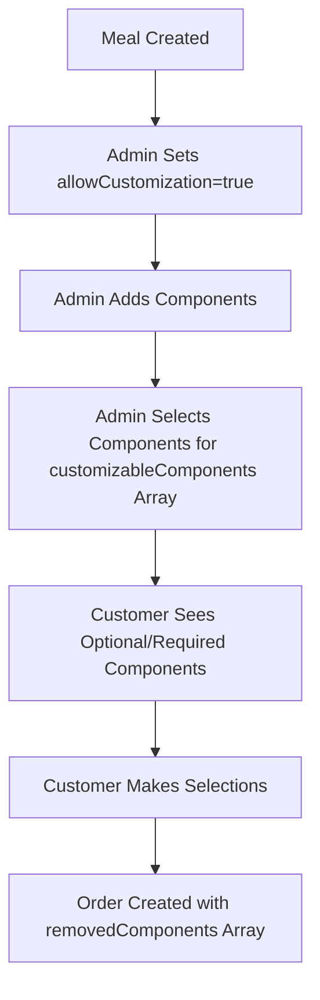

# Component Customization System - Architecture Decision

## Overview

This document explains the consolidation of the meal component customization system from two overlapping approaches to a single, cleaner approach.

## Previous State (Redundant Systems)

### System 1: `customizableComponents` Array (Meal Level)

```javascript
{
  id: "meal123",
  title: "Quinoa Buddha Bowl",
  allowCustomization: true,
  customizableComponents: ["1752404501869", "1752234579394"], // Component IDs
  components: [
    {
      componentId: "1752404501869",
      name: "Optional Side Sauce",
      // ... other component data
    }
  ]
}
```

### System 2: `isOptional`/`isRequired` Flags (Component Level) - DEPRECATED

```javascript
{
  components: [
    {
      componentId: "1752404501869",
      name: "Optional Side Sauce",
      isOptional: true, // ❌ DEPRECATED
      isRequired: false, // ❌ DEPRECATED
      // ... other component data
    },
  ];
}
```

## Decision: Keep `customizableComponents`, Remove `isOptional`/`isRequired`

### Rationale

#### **Advantages of `customizableComponents` System:**

1. **Single Source of Truth**

   - All customization logic centralized at meal level
   - No conflicts between meal-level and component-level settings
   - Easier to maintain and debug

2. **Better Performance**

   - One array lookup vs checking every component
   - Simpler conditional logic in UI components
   - Faster rendering of customization interfaces

3. **Cleaner API**

   - Consistent with `allowCustomization` boolean
   - Follows principle of keeping related data together
   - More intuitive for developers

4. **Active Usage**

   - All current UI components rely on this system:
     - `MealComponentCustomizer.jsx`
     - `ComponentsEditor.jsx`
     - `MealEditor.jsx`
     - `MealPreview.jsx`

5. **Better UX Control**
   - Admin can easily toggle component customization
   - Clear separation between required and optional components
   - Supports complex customization rules

#### **Problems with `isOptional`/`isRequired` System:**

1. **Redundancy**

   - Creates conflicting sources of truth
   - Can lead to inconsistent states

2. **Maintenance Issues**

   - Double the number of places to check for customization logic
   - Potential for bugs when systems disagree

3. **Component Complexity**
   - Makes component data structure more complex
   - Harder to understand which field takes precedence

## Implementation Changes

### 1. ComponentsEditor.jsx Updates

- ✅ Removed deprecated `isOptional`/`isRequired` from form state
- ✅ Removed "Component Type" selector from UI
- ✅ Updated form reset functions
- ✅ Added clarifying comments

### 2. Database Cleanup

- ✅ Created migration script: `src/utils/migrationCleanupComponents.js`
- 🔄 **Action Required**: Run cleanup script on existing data

### 3. Current System Flow



## Migration Guide

### For Existing Data

1. Run the migration script:
   ```javascript
   // In browser console on admin panel
   await cleanupComponentFields();
   ```

### For New Development

- ❌ **Don't use**: `component.isOptional`, `component.isRequired`
- ✅ **Use**: `meal.customizableComponents` array with `meal.allowCustomization`

### Component Customization Logic

```javascript
// ✅ Correct way to check if component is customizable
const isCustomizable =
  meal.allowCustomization &&
  meal.customizableComponents?.includes(component.componentId);

// ❌ Don't use deprecated fields
const isCustomizable = component.isOptional; // DEPRECATED
```

## Benefits Achieved

1. **Simplified Codebase**: Single customization system
2. **Better Performance**: Fewer conditional checks
3. **Cleaner Data Model**: No redundant fields
4. **Easier Maintenance**: One source of truth
5. **Future-Proof**: Extensible for complex customization rules

## Testing Recommendations

1. **Verify Existing Meals**

   - Check that existing customizable meals still work correctly
   - Ensure component removal functions properly

2. **Test New Meal Creation**

   - Create new meal with customizable components
   - Verify customization interface works as expected

3. **Database Integrity**
   - Run migration script on staging environment first
   - Verify no data loss during cleanup

## Conclusion

This consolidation simplifies the customization system while maintaining all functionality. The `customizableComponents` array approach is more maintainable, performant, and aligns better with the overall application architecture.
